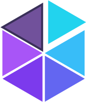

# Tessel.NET



A modern, themeable UI framework for **WPF on .NET 10**.

- Light, dark and system themes, switchable at runtime
- Custom accent colors (or the Windows accent)
- Restyled standard WPF controls — merge one dictionary and they're all styled
- Custom controls: `TesselWindow`, `NavigationView`, `ContentDialog`, `Snackbar`, `InfoBar`, `Card`, `SettingsCard`, `ToggleSwitch`, `NumberBox`, `ProgressRing`, `Badge`, `Avatar`, `FontIcon`
- MVVM helpers: `ObservableObject`, `RelayCommand`, `RelayCommand<T>`, `AsyncRelayCommand`
- Converters: bool/null → Visibility, inverse bool, enum ↔ bool, color → brush

```
Tessel.NET.slnx
├── src/Tessel.UI            the library
└── samples/Tessel.Gallery   a demo app showing every control
```

Run the gallery:

```bash
dotnet run --project samples/Tessel.Gallery
```

## Getting started

Reference `Tessel.UI`, then merge the theme into `App.xaml`:

```xml
<Application xmlns:tessel="http://schemas.tessel.net/ui" ...>
    <Application.Resources>
        <ResourceDictionary>
            <ResourceDictionary.MergedDictionaries>
                <tessel:ThemeResources Theme="System" Accent="#4F46E5" />
            </ResourceDictionary.MergedDictionaries>
        </ResourceDictionary>
    </Application.Resources>
</Application>
```

If you want the custom title bar, derive your windows from `TesselWindow`:

```xml
<tessel:TesselWindow x:Class="MyApp.MainWindow"
                     xmlns:tessel="http://schemas.tessel.net/ui" ...>
```

```csharp
public partial class MainWindow : TesselWindow { ... }
```

## Theming

```csharp
ThemeManager.SetTheme(AppTheme.Dark);          // Light, Dark or System
ThemeManager.SetAccent(Color.FromRgb(0, 120, 212));
ThemeManager.SetAccent(null);                  // back to the built-in accent
ThemeManager.UseSystemAccent();                // Windows accent color
ThemeManager.ThemeChanged += (_, _) => { ... };
```

Every color is a resource. Use `DynamicResource` so it follows theme changes:

| Resource | Use |
| --- | --- |
| `Tessel.BackgroundBrush`, `Tessel.SurfaceBrush`, `Tessel.SurfaceAltBrush`, `Tessel.SubtleBrush` | window, cards, layers |
| `Tessel.TextBrush`, `Tessel.TextSecondaryBrush`, `Tessel.TextTertiaryBrush`, `Tessel.TextDisabledBrush` | text |
| `Tessel.BorderBrush`, `Tessel.BorderStrongBrush` | strokes |
| `Tessel.ControlBackgroundBrush`, `Tessel.ControlHoverBrush`, `Tessel.ControlPressedBrush`, `Tessel.InputBackgroundBrush` | control states |
| `Tessel.AccentBrush`, `Tessel.AccentHoverBrush`, `Tessel.AccentPressedBrush`, `Tessel.AccentSubtleBrush`, `Tessel.OnAccentBrush` | accent |
| `Tessel.{Success,Warning,Danger,Info}Brush` and `…SubtleBrush` | status colors |
| `Tessel.Shadow`, `Tessel.ShadowLarge` | drop shadow effects |
| `Tessel.FontFamily`, `Tessel.IconFontFamily`, `Tessel.MonoFontFamily`, `Tessel.ControlCornerRadius`, … | typography & shape |

Text styles: `Tessel.Text.Display`, `.Title`, `.Subtitle`, `.BodyStrong`, `.Body`, `.Secondary`, `.Caption`, `.Code`, `.Icon`.

## Styled standard controls

Button, RepeatButton, ToggleButton, Hyperlink, CheckBox, RadioButton, TextBox, PasswordBox, RichTextBox, ComboBox, Slider, ProgressBar, ScrollViewer/ScrollBar, ListBox, TabControl, Expander, GroupBox, Menu, ContextMenu, MenuItem, Separator, ToolTip, DataGrid, TreeView, Calendar, DatePicker, Label, GridSplitter, StatusBar.

Button variants: `Tessel.Button.Accent`, `.Outline`, `.Subtle`, `.Danger`, `.Icon`, `.Link`.

### Attached properties (`tessel:ControlHelper`)

| Property | Applies to | Effect |
| --- | --- | --- |
| `Header` | TextBox, PasswordBox, ComboBox, DatePicker, NumberBox | label above the input |
| `PlaceholderText` | TextBox, PasswordBox, ComboBox | hint shown while empty |
| `Icon` | buttons, TextBox, PasswordBox | leading icon (`{tessel:Glyph Search}`) |
| `ShowClearButton` | TextBox, PasswordBox | "x" button that clears the text |
| `CornerRadius` | most controls | overrides the corner radius |
| `HoverBackground`, `PressedBackground` | buttons | custom state colors |

```xml
<TextBox tessel:ControlHelper.Header="Email"
         tessel:ControlHelper.PlaceholderText="name@example.com"
         tessel:ControlHelper.Icon="{tessel:Glyph Mail}"
         tessel:ControlHelper.ShowClearButton="True" />
```

## Custom controls

```xml
<!-- Navigation: items with TargetPageType create (and cache) that page when selected -->
<tessel:NavigationView PaneTitle="My App">
    <tessel:NavigationView.MenuItems>
        <tessel:NavigationViewItem Content="Home" Icon="{tessel:Glyph Home}" TargetPageType="{x:Type pages:HomePage}" />
        <tessel:NavigationViewItemHeader Content="Section" />
    </tessel:NavigationView.MenuItems>
    <tessel:NavigationView.FooterMenuItems>
        <tessel:NavigationViewItem Content="Settings" Icon="{tessel:Glyph Settings}" TargetPageType="{x:Type pages:SettingsPage}" />
    </tessel:NavigationView.FooterMenuItems>
</tessel:NavigationView>

<tessel:Card Header="Profile" IsElevated="True">...</tessel:Card>
<tessel:SettingsCard Header="Notifications" Description="…" Icon="{tessel:Glyph Ringer}">
    <tessel:ToggleSwitch IsChecked="True" />
</tessel:SettingsCard>
<tessel:InfoBar Severity="Warning" Title="Heads up" Message="…" />
<tessel:NumberBox Minimum="0" Maximum="100" Value="{Binding Quantity}" />
<tessel:ProgressRing IsActive="{Binding IsBusy}" />
<tessel:Badge Content="New" Kind="Success" />
<tessel:Avatar DisplayName="Ada Lovelace" />
<tessel:FontIcon Symbol="Save" />
```

Plug a DI container into `NavigationView.PageFactory` to construct pages.

Dialogs and snackbars work in any `Window` (they are placed on the window's adorner layer):

```csharp
var result = await new ContentDialog
{
    Title = "Delete file?",
    Content = "This can't be undone.",
    PrimaryButtonText = "Delete",
    CloseButtonText = "Cancel",
    IsPrimaryDestructive = true,
}.ShowAsync();

Snackbar.Show("Saved", "Your changes were saved.", InfoBarSeverity.Success);
```

## Icons

`Symbol` lists common Segoe Fluent Icons glyphs (with Segoe MDL2 Assets as a fallback on Windows 10). Use `{tessel:Glyph Name}` wherever a glyph string is expected, or `<tessel:FontIcon Symbol="Name" />`. The gallery's Icons page shows all of them.
